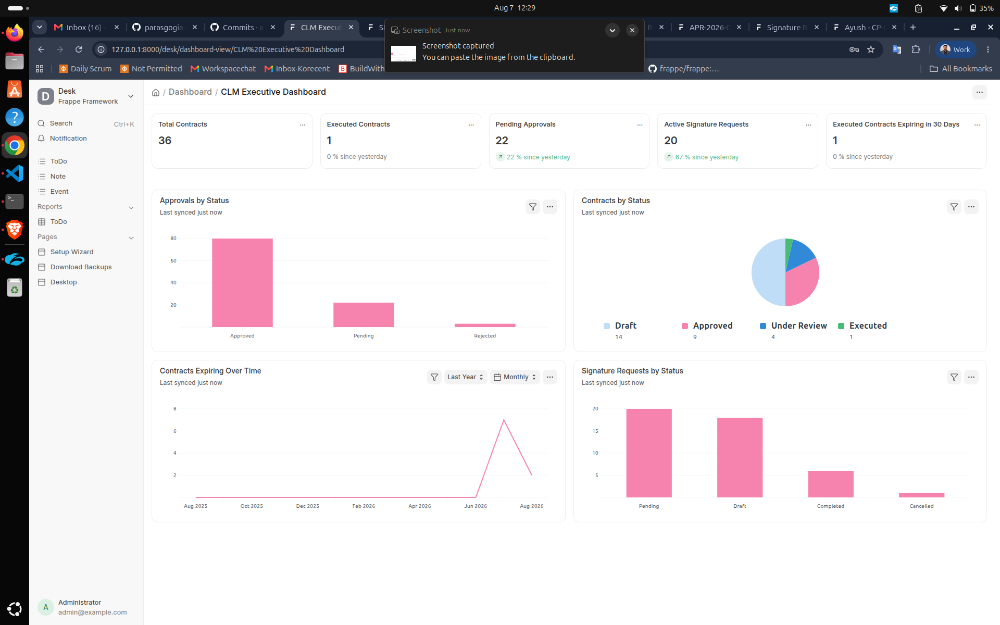
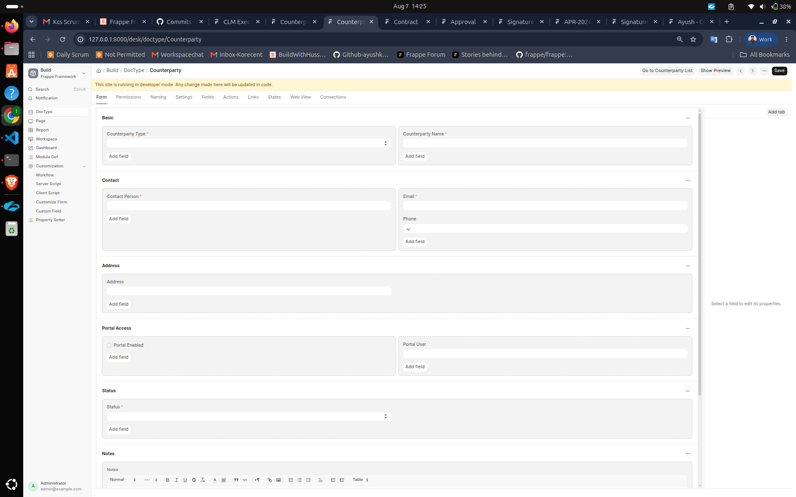
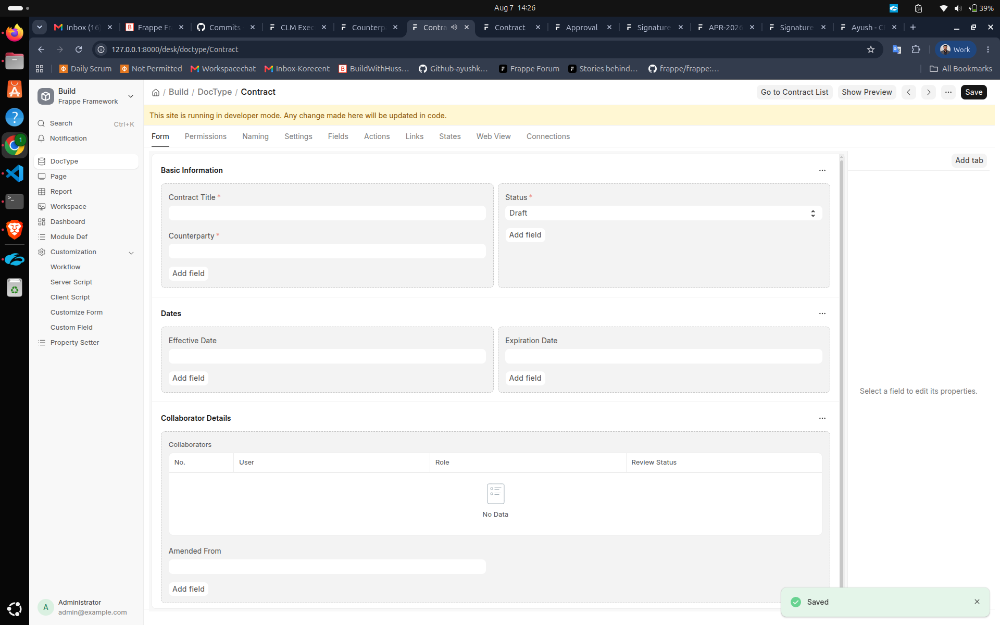
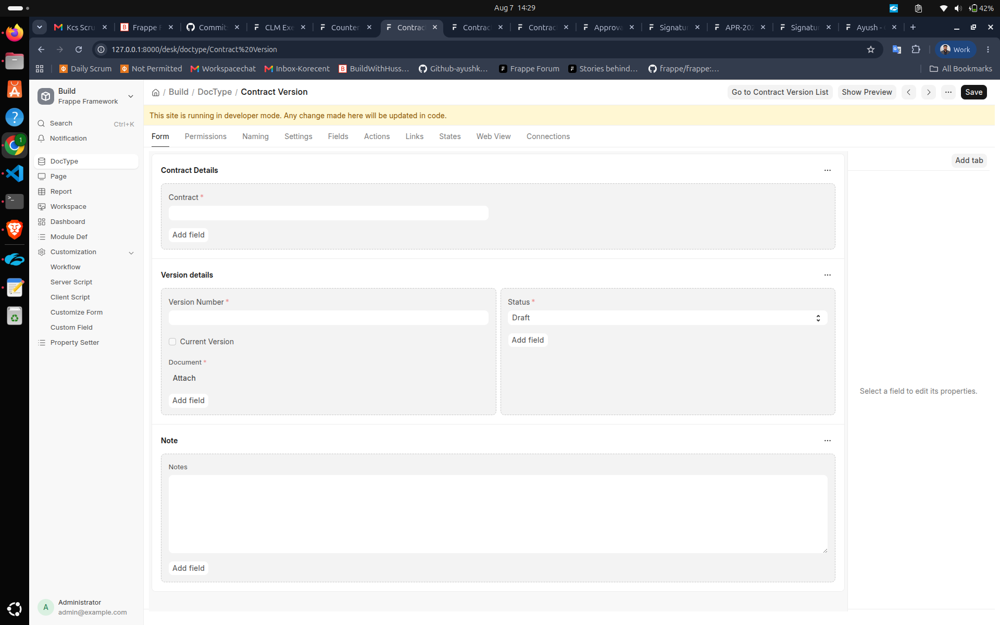
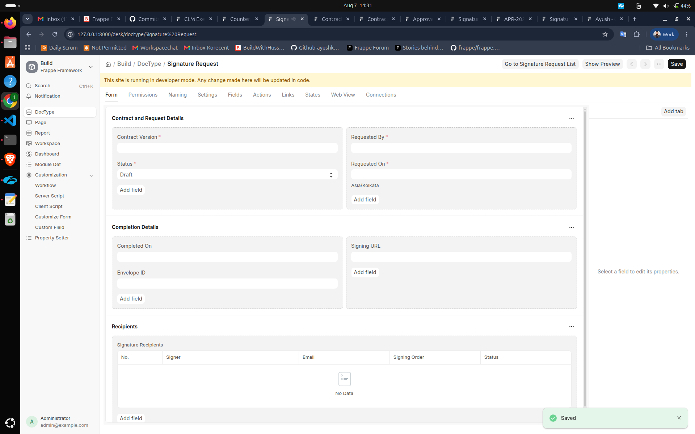
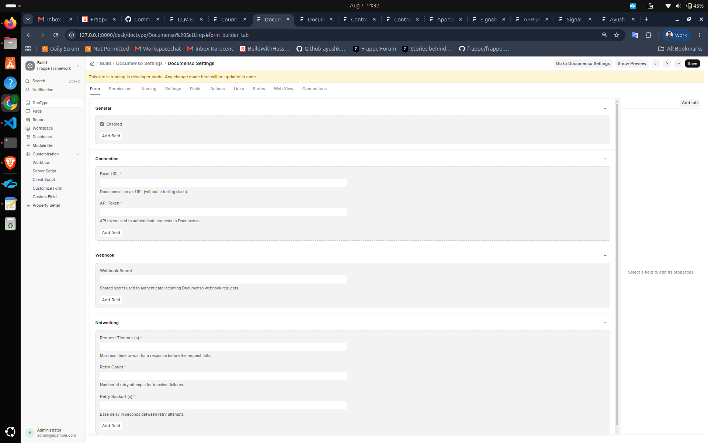
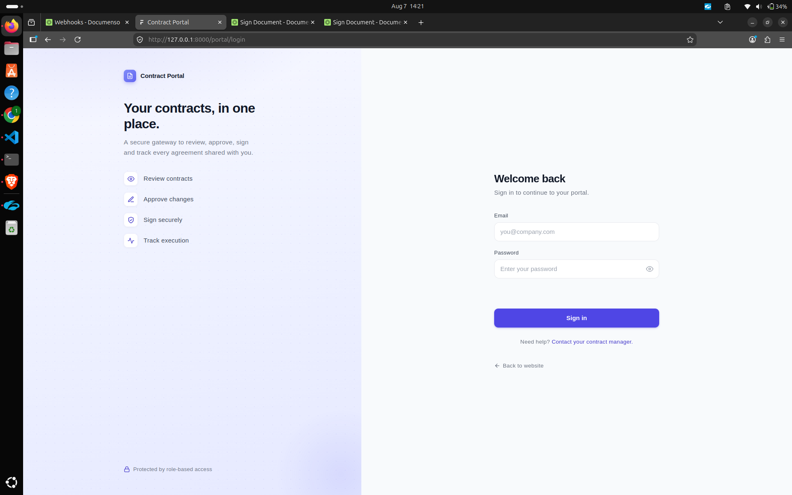
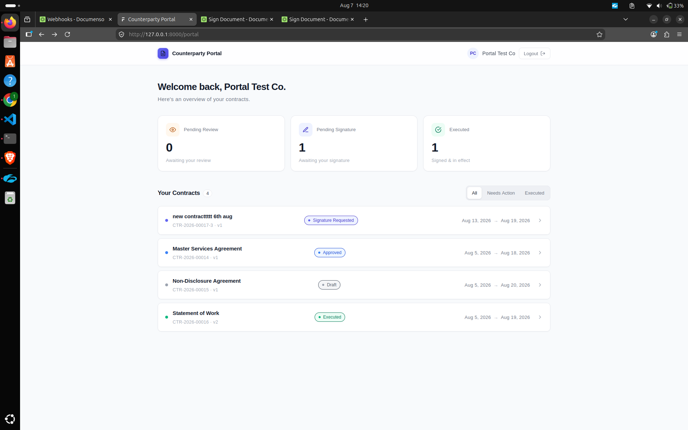
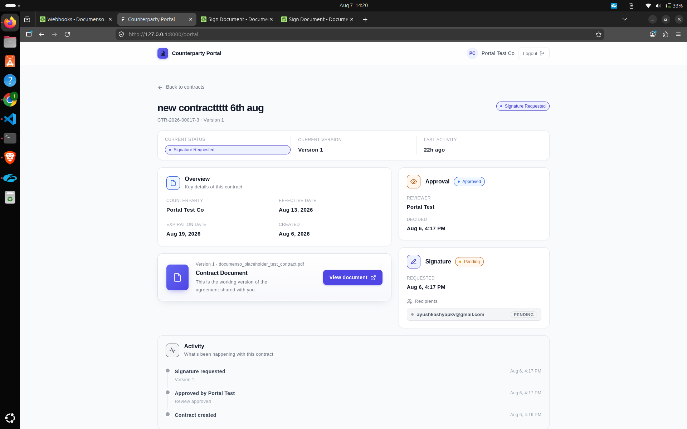

# Contract Lifecycle Management System (CLM)

An enterprise-grade **Contract Lifecycle Management** system built on the
**Frappe Framework v16** (Python) with MariaDB, Redis and a Vue 3 Counterparty
Portal, integrated with **Documenso** for electronic signatures.

The system covers the full contract journey — drafting, versioning, internal
approval, electronic signing, execution, expiry tracking and counterparty
self-service — on a single platform with a complete audit trail.

---

## Project Overview

Organizations manage contracts across email threads and shared folders, which
leads to lost versions, unaccountable approvals, unclear signing state and
missed renewals.

This CLM system solves those problems by:

- Storing contracts as **immutable, versioned** documents with one current version per contract.
- Running **multi-role internal approvals** (Approver, Legal, Finance, Business Owner) through a Frappe workflow.
- Orchestrating **electronic signatures** via the Documenso API with webhook-driven completion.
- Exposing a **Counterparty Portal** where external users review, approve and sign the agreements shared with them.
- Surfacing **reports** and an **executive dashboard** for governance.

---

## Features

### Administration
- Counterparty management (companies and individuals) with portal access control.
- System Manager-scoped desk access; workflow-driven role gates.
- Centralized Documenso settings (base URL, API token, webhook secret, retry/network tuning).

### Contracts
- Submittable Contract documents with expression naming series (`CTR-YYYY-#####`).
- Immutable **Contract Versions** with attached PDF documents.
- Single **current version** enforcement via a database row lock.
- Collaborator matrix (Reviewer / Approver / Legal / Finance / Business Owner) with review status.
- Date validation (effective ≤ expiration), unique-version, and unique-collaborator rules.

### Approvals
- One **Approval** record per approval-capable collaborator on submission.
- Approve / Reject with remarks and timestamps.
- Version transitions to `Approved` only when **all** approvals pass; any rejection sends the version to `Rejected` (revise → Draft).
- Desk buttons and portal review both drive the same service layer.

### Signatures
- Draft → **Send for Signature** flow for approved, current versions.
- **Documenso V2 envelope API** (`envelope/create`, `envelope/distribute`).
- PDF placeholder validation (`{{signature,rN}}`) before sending.
- Ordered recipients with sequential signing order; per-recipient status and signed timestamps.
- **Webhook-driven** completion (`DOCUMENT_COMPLETED`) with idempotency handling.

### Portal
- Dedicated branded login page (`/portal/login`).
- Vue 3 SPA dashboard with stat cards and segmented contract lists.
- Contract detail with overview, document download, approval panel, signing panel and activity timeline.
- Role-based home routing (`role_home_page`) for the `Counterparty` role.

### Reports
- Contract Summary
- Expiring Contracts (with days remaining)
- Pending Approvals (with approver role and days pending)
- Pending Signature Requests (with days pending)

### Documenso
- Isolated `docusign_integration` app with a transport-agnostic HTTP client.
- Authenticated webhook endpoint using a shared secret compared in constant time.
- Event dispatcher (`WebhookDispatcher`) and `SignatureService` completion handling.

---

## Technology Stack

| Layer | Technology |
|-------|-----------|
| Framework | Frappe Framework **v16.27.1** |
| Language | Python 3.14 |
| Database | MariaDB |
| Cache / Queues | Redis |
| Web Server | Gunicorn / Nginx (bench-managed) |
| Portal | Vue 3 (SPA, via Frappe web pages) |
| E-Signature | Documenso API (v1 verify + v2 envelope) |
| PDF parsing | pypdf |
| HTTP | requests |

---

## System Architecture

The codebase is split into two apps:

- **`contract_management`** — core domain, service layer, portal, webhooks, reports, dashboard.
- **`docusign_integration`** — Documenso transport, configuration and exceptions.

Layers (bottom-up): Doctype controllers → **service layer** (Contract,
ContractVersion, Approval, Signature, Workflow, Notification) → webhook/portal
APIs → Documenso provider → Documenso REST API.

See [docs/ARCHITECTURE.md](docs/ARCHITECTURE.md) for the full architecture and
[docs/diagrams.md](docs/diagrams.md) for Mermaid diagrams.

---

## Folder Structure

```text
frappe-bench/
└── apps/
    ├── contract_management/                 # Core CLM app
    │   └── contract_management/
    │       ├── api/documenso_webhook.py     # Webhook endpoint
    │       ├── constants/                   # workflow/transition/webhook constants
    │       ├── services/                    # Service layer
    │       ├── doctype/                     # Doctypes + controllers + tests
    │       ├── report/                      # 4 script reports
    │       ├── contract_management_dashboard/  # Executive dashboard
    │       ├── dashboard_chart/  number_card/
    │       ├── fixtures/                    # workflow, states, action masters
    │       ├── portal_api.py                # Portal whitelisted APIs
    │       ├── templates/pages/portal.*     # Portal shell
    │       ├── www/portal/                  # Portal login page
    │       └── public/portal/               # Vue SPA + login assets
    │
    └── docusign_integration/                # Documenso integration app
        └── docusign_integration/
            ├── provider.py                  # Provider API surface
            ├── http_client.py               # Transport (requests)
            ├── integration_config.py        # Settings lookup
            ├── exceptions.py                # Error hierarchy
            └── doctype/documenso_settings/  # Settings single document
```

---

## Installation

Requirements:

- Python 3.14 (as configured by `pyproject.toml`)
- Frappe Framework v16 (`version-16` branch)
- MariaDB, Redis

```bash
# 1. Create a bench (if you do not already have one)
bench init frappe-bench --frappe-branch version-16
cd frappe-bench

# 2. Get the apps
bench get-app contract_management <repo-url> --branch version-16
bench get-app docusign_integration <repo-url> --branch version-16

# 3. Create and install on a site
bench new-site contract.local --db-root-password <password>
bench --site contract.local install-app contract_management
bench --site contract.local install-app docusign_integration

# 4. Run the site
bench start
```

> `contract_management` depends on `docusign_integration` for the signature
> workflow. Install both apps.

---

## Bench Setup

This repository ships with a ready-to-use bench (`frappe-bench/`) including the
installed apps and a site (`contract.local`). `common_site_config.json` already
configures Redis (cache/queue/socket.io), background workers, and
`webserver_port: 8000`.

If you use the bundled bench:

```bash
cd frappe-bench
bench start        # http://localhost:8000
```

Create the **CLM roles** in the desk (System Manager) if they do not already
exist: `Contract Manager`, `Approver`, `Counterparty`, plus the collaborator
roles `Legal`, `Finance`, `Business Owner`. Assign roles to users as needed.

---

## Running

1. `bench start` (or your production supervisor/systemd config).
2. Access the desk at `http://localhost:8000/app`.
3. **System Manager** manages everything from the desk:
   - Create Counterparties → enable portal access and assign a portal user.
   - Create and submit Contracts → add collaborators.
   - Create Contract Versions → attach the PDF → **Submit for Review**.
   - Approve/Reject through Approval records.
   - Create a Signature Request → **Send for Signature**.
4. **Counterparties** log in at `http://localhost:8000/portal/login` and are
   taken to `/portal`.

---

## Configuration

### Documenso Settings

Configure under `Docusign Integration → Documenso Settings` (System Manager):

| Setting | Description |
|---------|-------------|
| Enabled | Master switch for the integration |
| Base URL | Documenso server URL (no trailing slash) |
| API Token | Bearer token for the Documenso API |
| Webhook Secret | Shared secret verified on incoming webhooks (`X-Documenso-Secret`) |
| Request Timeout (s) | HTTP timeout (default 30) |
| Retry Count | Retries for transient failures (default 3) |
| Retry Backoff (s) | Base delay between retries (default 1.0) |

### Webhook Registration

Register the endpoint URL with Documenso:

```
https://<your-site>/api/method/contract_management.contract_management.api.documenso_webhook.handle_webhook
```

and set the same secret in both Documenso and Documenso Settings. See
[docs/API.md](docs/API.md) for the payload contract.

### Roles

| Role | Purpose |
|------|---------|
| System Manager | Full desk access and configuration |
| Contract Manager | Draft editing and workflow transitions (submit, revise, request signature, supersede) |
| Approver / Legal / Finance / Business Owner | Approval-capable collaborator roles |
| Counterparty | Routes home page to `/portal` |

---

## Workflow Overview

```text
Contract
   ↓
Version          Contract Manager attaches the PDF → Draft
   ↓
Approval         Submit for Review → Under Review → all approvers approve → Approved
   ↓
Signature        Send for Signature → Documenso envelope created & distributed → Signature Requested
   ↓
Execution        Documenso webhook (DOCUMENT_COMPLETED) → version Executed, contract live
```

Rejected versions return to Draft (`Revise`); a signature request can be
cancelled back to `Approved`. New versions supersede the previous current
version. See [docs/06-workflow-rules.md](docs/06-workflow-rules.md).

---

## Counterparty Portal

### Portal Login
A branded login page posts to Frappe's standard `/api/method/login`. Friendly
error messages cover invalid credentials, disabled accounts and rate limiting.

### Dashboard
Welcome header, stat cards (Pending Review, Pending Signature, Executed) and a
filterable contract list (All / Needs Action / Executed), ordered so items
needing attention appear first.

### Contract Detail
Status badge, current version summary, key dates, downloadable document,
approval panel (approve/reject with remarks when the user is the assigned
approver), signature panel with recipient chips, and an activity timeline.

### Approval
Only the logged-in counterparty's pending approval is actionable; decisions
are applied transactionally and the page refreshes with the server-confirmed
state.

### Signing
When the counterparty's signing turn is pending, the portal exposes their own
Documenso signing URL. The page silently refreshes when the user returns from
the Documenso tab, reflecting the webhook result.

---

## Documenso Integration

### Request Creation
`SignatureService.send_signature_request` validates the approved/current
version, verifies the PDF contains `{{signature,rN}}` placeholders, creates the
envelope (`envelope/create`), persists metadata, distributes it
(`envelope/distribute`), captures recipient IDs and the signing URL, and
transitions the version to `Signature Requested`.

### Webhook
Documenso posts events to the whitelisted endpoint. Every request is
authenticated with the shared secret (constant-time comparison). The dispatcher
routes events to handlers; `DOCUMENT_COMPLETED` drives execution.

### Synchronization
The completion handler matches signed recipients by `documenso_recipient_id`,
records `signed_on` timestamps, transitions the version to `Executed` and marks
the request `Completed` — idempotently, so duplicate deliveries are harmless.

---

## Reports

All reports are script reports available to System Manager:

- **Contract Summary** — every contract with its current version and dates.
- **Expiring Contracts** — expiration dates and days remaining.
- **Pending Approvals** — outstanding approvals, approver role and days pending.
- **Pending Signature Requests** — outstanding requests, version and days pending.

The **CLM Executive Dashboard** aggregates number cards (total/executed
contracts, pending approvals, active signature requests, expiring executed
contracts) and charts (approvals/contracts/signature requests by status,
contracts expiring over time).

---

## Security

- DocType permissions are restricted to **System Manager**; portal access is
  role-routed and ownership-checked on every portal API.
- Webhook requests require a shared secret compared with
  `hmac.compare_digest` (timing-safe).
- Signing URLs are never leaked: only the owning counterparty's pending URL is
  returned.
- Portal document downloads re-verify counterparty ownership and stream bytes
  instead of exposing `/private/files/`.
- Elevated (Administrator) transitions are scoped and restored
  (session-snapshot guard in `portal_api.py`).
- API tokens and webhook secrets are stored as Password fields
  (`get_password`), never logged.

---

## Screenshots

> Screenshots live in [`docs/screenshots/`](docs/screenshots/).

### Dashboard


### Counterparty


### Contract


### Contract Version


### Signature Request


### Documenso Settings


### Portal Login


### Portal Dashboard


### Portal Contract Detail


---

## Future Improvements

- Handle the remaining Documenso events (`document.rejected`, `document.sent`,
  `document.deleted`, `recipient.completed`, `recipient.signed`).
- Notify teams on webhook-driven completion (already a service hook).
- Automatic contract-status synchronisation from version state.
- Renewal automation and expiry alerts.
- Clause library, contract templates and AI review.
- Email notifications on top of the existing in-app notifications.

---

## License

[MIT](LICENSE)