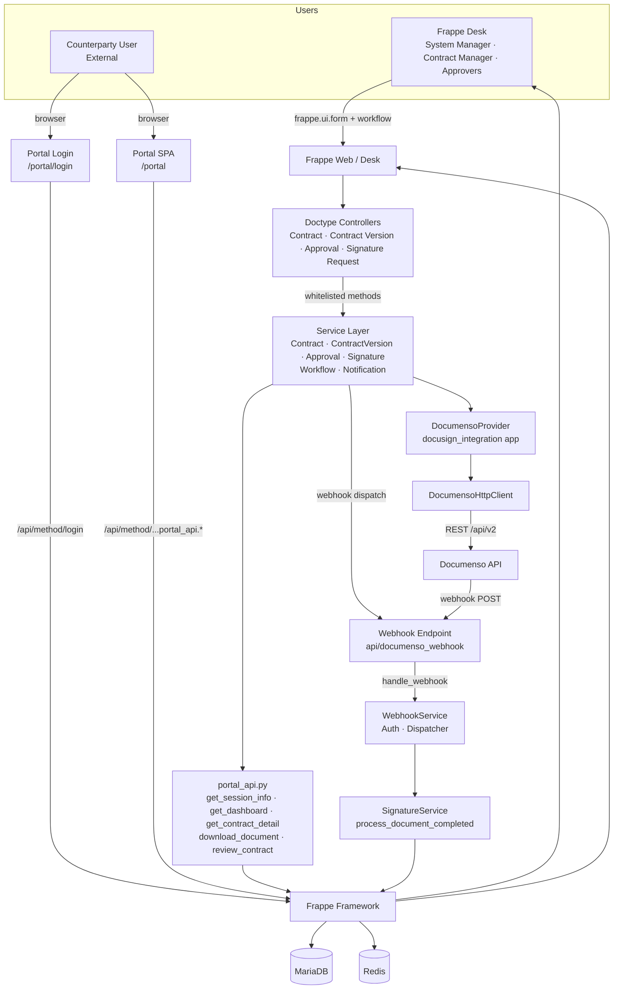
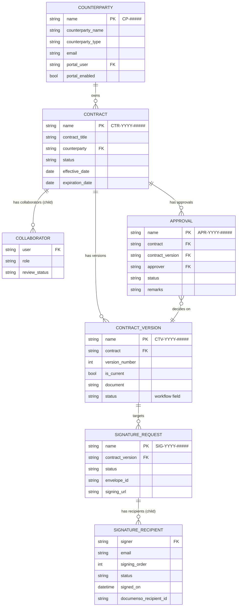
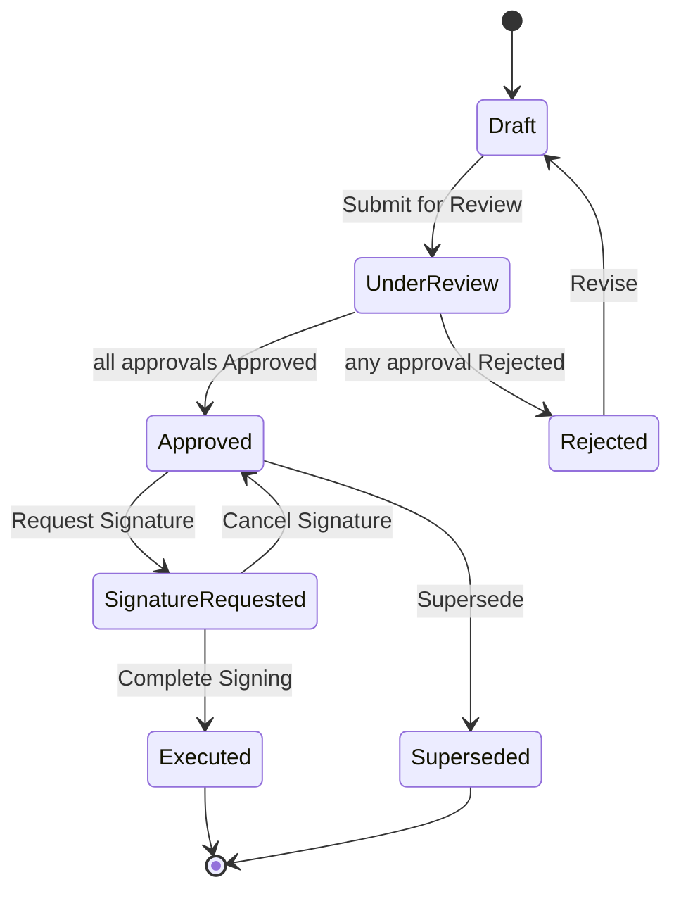
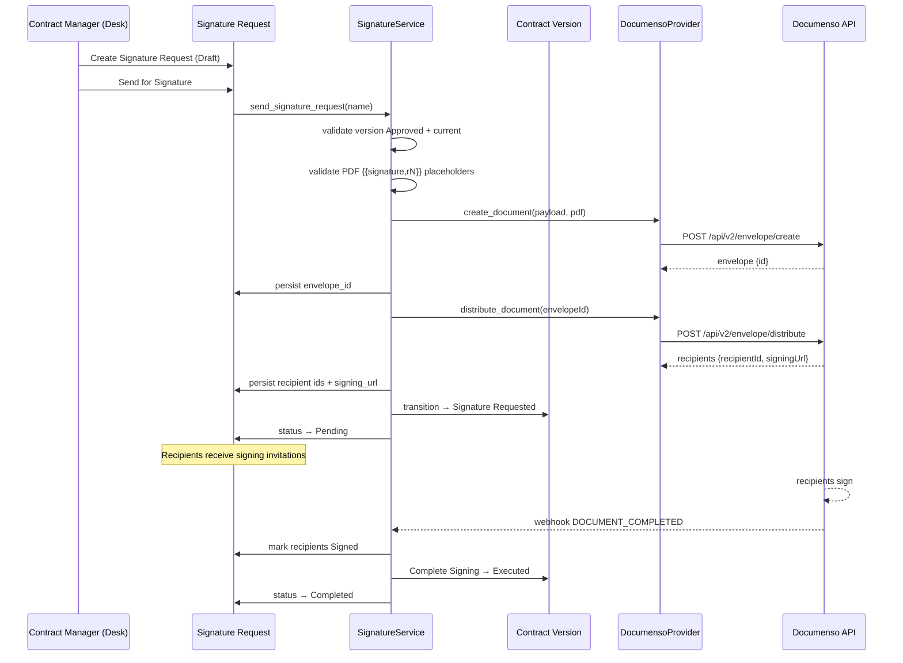
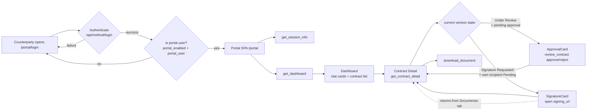
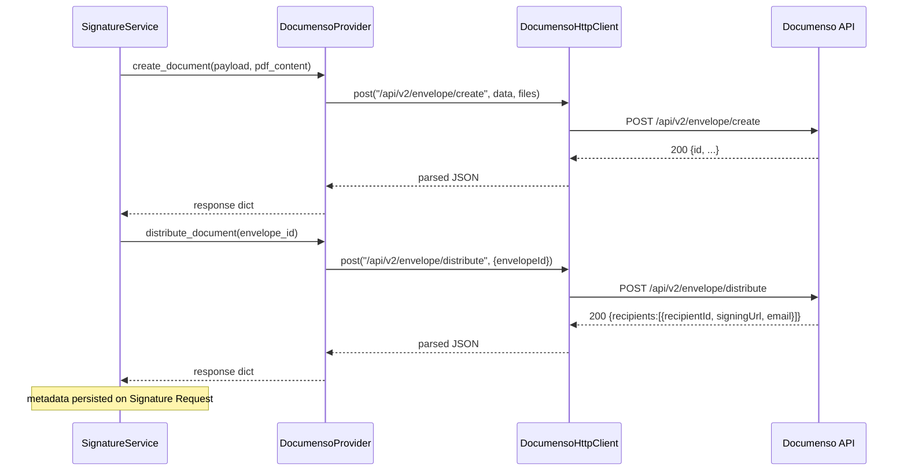
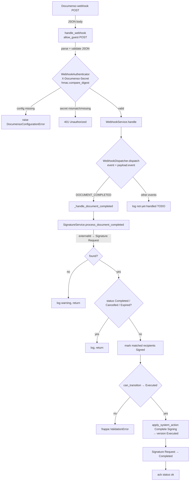
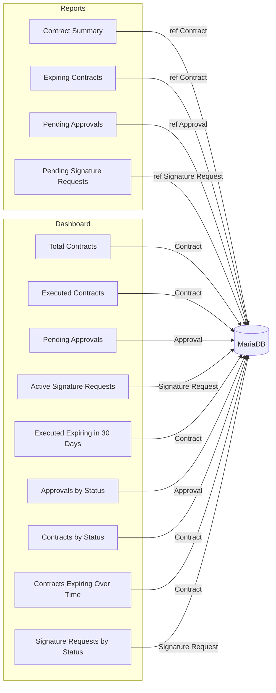

# Architecture Diagrams

Mermaid diagrams for the Contract Lifecycle Management (CLM) system. Each
diagram reflects the current implementation.

---

## 1. System Architecture

---

## 2. Database Relationships

---

## 3. Approval Workflow

> Note: the version only enters `Approved` when **every** Approval record for
> the version is Approved; any single rejection sends the version to
> `Rejected`.

---

## 4. Signature Workflow

---

## 5. Counterparty Portal Flow

---

## 6. Documenso Integration

Configuration (`Documenso Settings`): `enabled`, `base_url`, `api_token`
(Password), `request_timeout`, `retry_count`, `retry_backoff`, `webhook_secret`
(Password).

---

## 7. Webhook Flow

---

## Appendix — Desk Report / Dashboard composition

