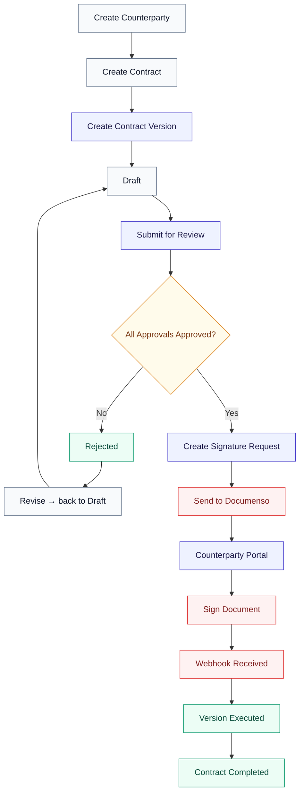
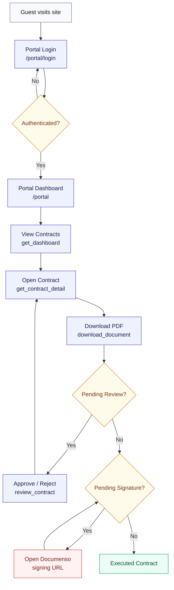
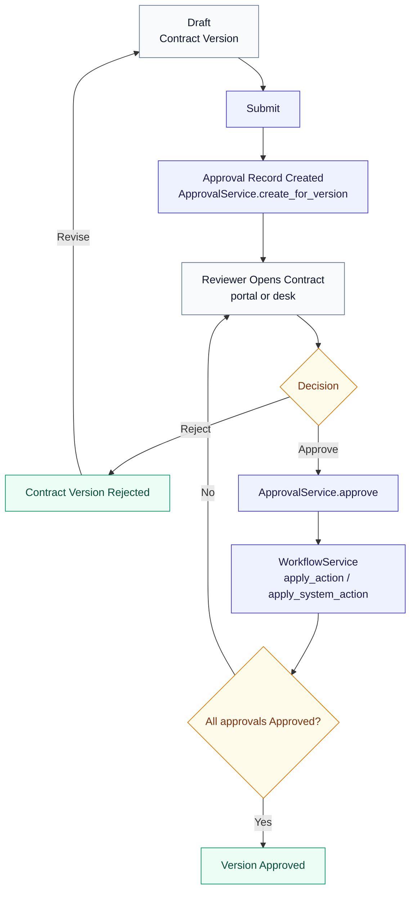
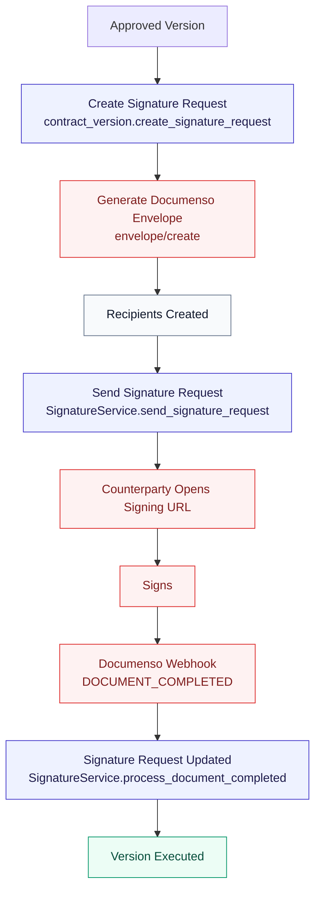
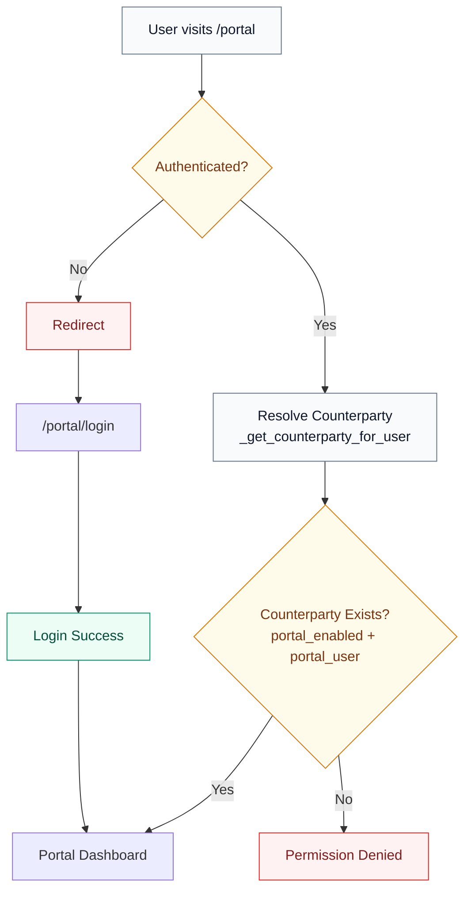
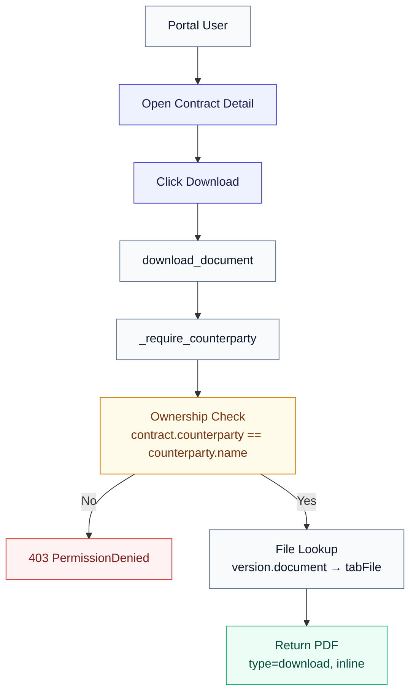
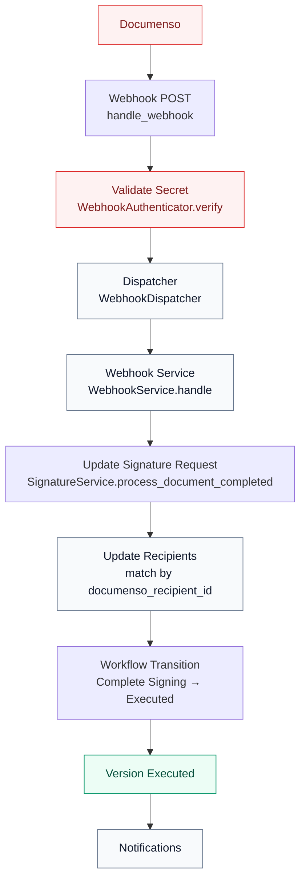
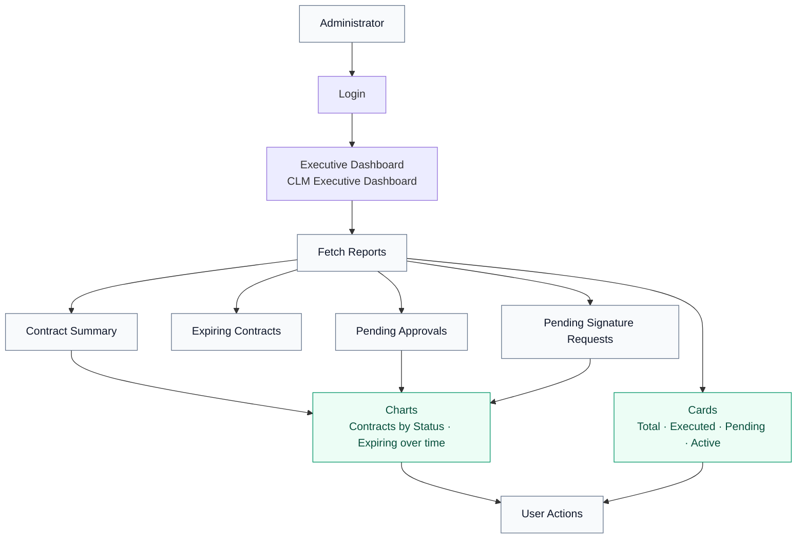
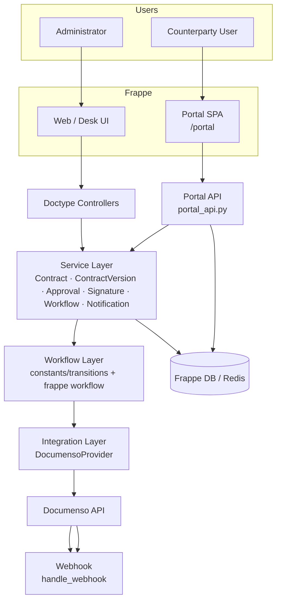
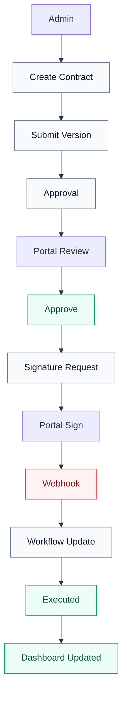

# Contract Lifecycle Management — Flowcharts

This document contains GitHub-compatible Mermaid diagrams for the Contract
Lifecycle Management (CLM) system. Every diagram reflects the **current
implementation** in the repository.

## Reusable style

All diagrams use a shared colour palette:

| Class | Purpose | Fill / Stroke |
|-------|---------|---------------|
| `ap` | Portal / API process | indigo |
| `proc` | Business process | slate |
| `dec` | Decision | amber |
| `ter` | Terminal / result | emerald |
| `ext` | External (Documenso) | rose |
| `store` | Data / persistence | blue |

```mermaid
flowchart LR
    classDef ap fill:#eef2ff,stroke:#4338ca,color:#1e1b4b
    classDef proc fill:#f8fafc,stroke:#64748b,color:#0f172a
    classDef dec fill:#fffbeb,stroke:#d97706,color:#78350f
    classDef ter fill:#ecfdf5,stroke:#059669,color:#064e3b
    classDef ext fill:#fef2f2,stroke:#dc2626,color:#7f1d1d
    classDef store fill:#eff6ff,stroke:#2563eb,color:#1e3a8a
```

---

## 1. Complete Contract Lifecycle

This is the end-to-end journey from creating a counterparty to a fully executed
contract, including the branch where approvals fail.



> Implementation notes: submissions go through `ContractVersionService.submit_for_review`
> → `ApprovalService`; sending uses `SignatureService.send_signature_request` →
> Documenso V2 `envelope/create` + `envelope/distribute`; completion is driven by the
> `DOCUMENT_COMPLETED` webhook via `SignatureService.process_document_completed`.

---

## 2. Counterparty Portal Flow

How a guest becomes an authenticated counterparty and navigates the portal to
sign a contract.



### Implementation notes
- Login posts to Frappe's `/api/method/login` (`public/portal/login.js`).
- Every portal API is guard-oriented by `_require_counterparty` / `_get_counterparty_for_user`
  (ownership is enforced server-side).

---

## 3. Contract Approval Workflow

The internal multi-approver decision flow, including rejection and the
revision loop.



### Implementation notes
`ApprovalService.create_for_version` creates one Approval per approval-capable
collaborator (roles in `APPROVAL_ROLES`). The version becomes `Approved` only
when every approval is `Approved`; any rejection sends it to `Rejected`.

---

## 4. Signature Workflow

From an approved version through Documenso and back to execution.



### Implementation notes
PDF placeholder validation (`{{signature,rN}}`) happens before
`envelope/create`. Recipient IDs and the signing URL are persisted from the
`envelope/distribute` response.

---

## 5. Portal Authorization Flow

How the `/portal` route decides whether to show the dashboard or redirect to
login.



> Note: `portal.py` redirects guests back to `/app` (or the login route) and
> `login.py` redirects already-authenticated counterparties straight to `/portal`.

---

## 6. Document Download Flow

Ownership-guarded file streaming for the portal.



### Implementation notes
Access is gated server-side; `/private/files/` URLs are never exposed directly
to portal users.

---

## 7. Webhook Processing Flow

`DOCUMENT_COMPLETED` end-to-end.



### Implementation notes
- Auth: `WebhookAuthenticator.verify` compares `X-Documenso-Secret` with
  `hmac.compare_digest`.
- Idempotent: already-Completed, Cancelled and Expired requests are ignored.
- Other events (`document.deleted`, `document.rejected`, `document.sent`,
  `recipient.completed`, `recipient.signed`) are logged placeholders.

---

## 8. Admin Dashboard Flow

How the administrator reaches executive intelligence.



> `Reports` are script reports restricted to System Manager; the dashboard is an
> Frappe desk dashboard assembled from number cards and charts.

---

## 9. System Architecture Flow

Layered view of the whole system.



> Comments: the flow is desk/portal → controllers/portal_api → services →
> workflow → Documenso, with the webhook endpoint feeding back into the service
> layer. Data persists to Frappe/Redis.

---

## 10. End-to-End System Flow

The full journey in a single diagram, including the portal handoff.



---

## Validation

Each Mermaid block above uses only features that render on GitHub:

- `flowchart TD` / `flowchart LR`
- `subgraph` grouping with optional titles
- decision diamonds with `{}`
- node labels with an em-dash and `:::class` style classes
- consistent `classDef` palette for every diagram

Every diagram is a single labelled code block with valid Mermaid syntax.